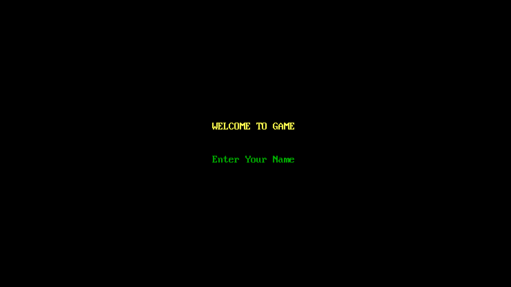
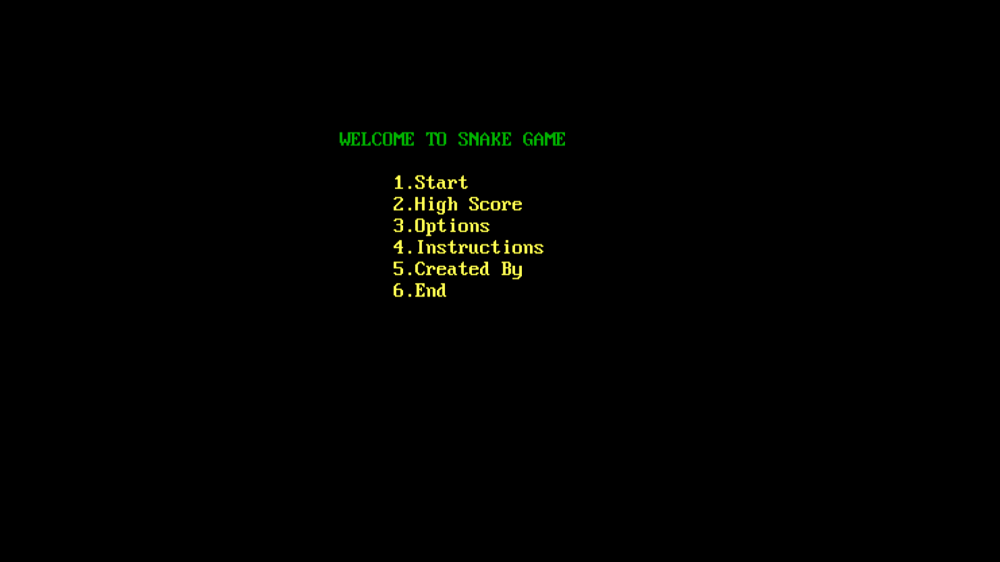
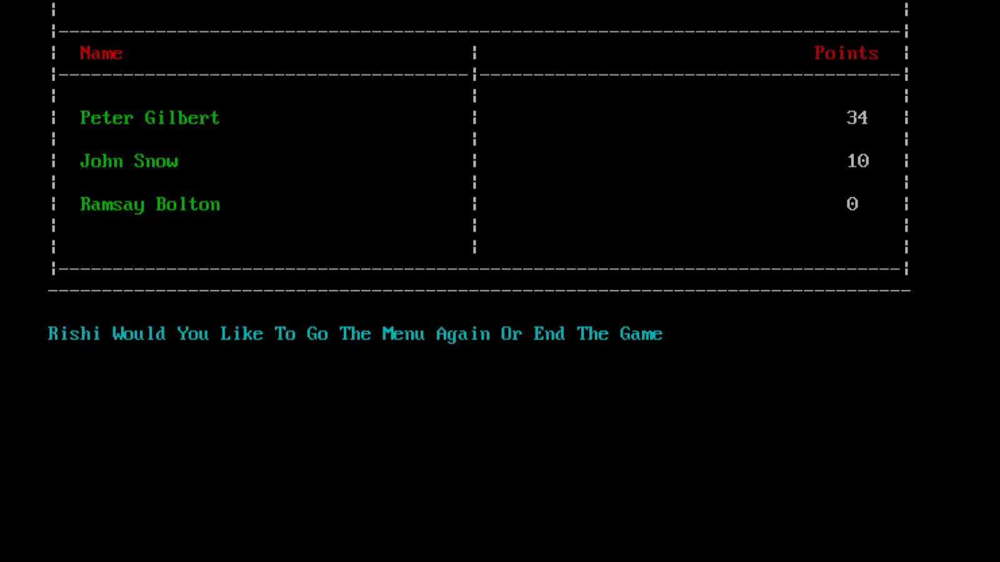
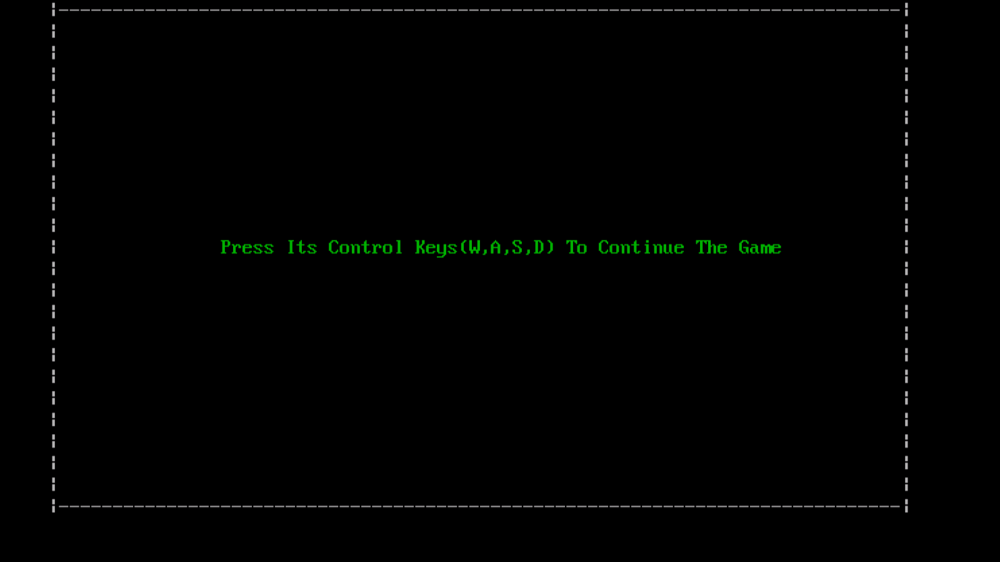
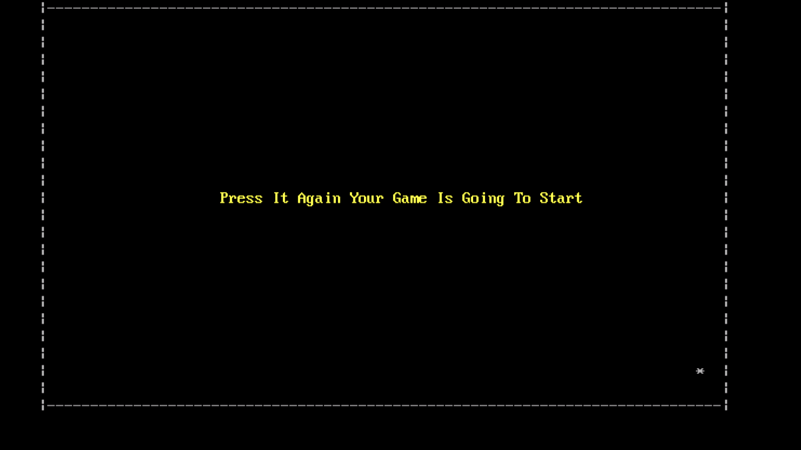
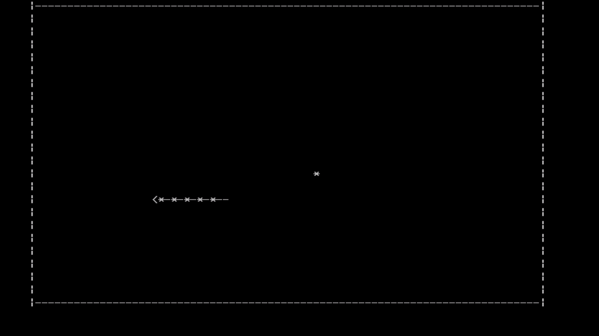
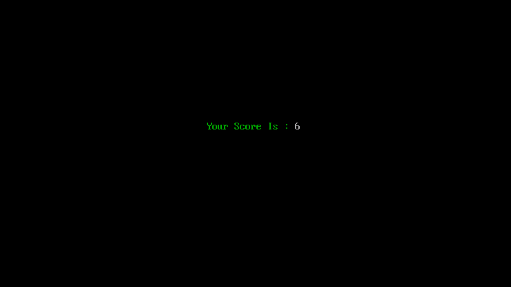
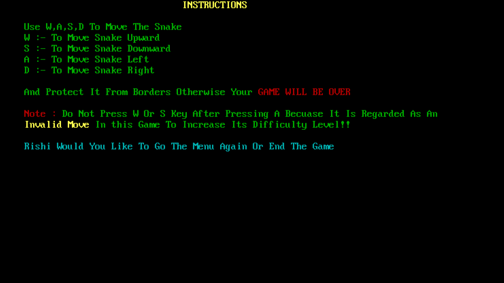

# About Snake Game
It is a game that is solely build on C++ without using any external library for graphics. It is totally build
on logic.

## In order to play the game
Just download setup file which is present inside setup folder. It is an .exe file so you can only install it 
on windows. 

If you want to play it on linux then you have to install turboC++ in your machine and then download all the files present inside CPP folder and run the main.cpp file.<br>

#### NOTE : 
This game can only run in TurboC++ because during the creation of this game I have used the function which was later deprecated from latest compilers. So run this game only in TurboC++.
```bash
gotoxy()
``` 
## Code
Just see the files present inside CPP folder.

## Screenshots

 

 

 

 

 

 

 

 
